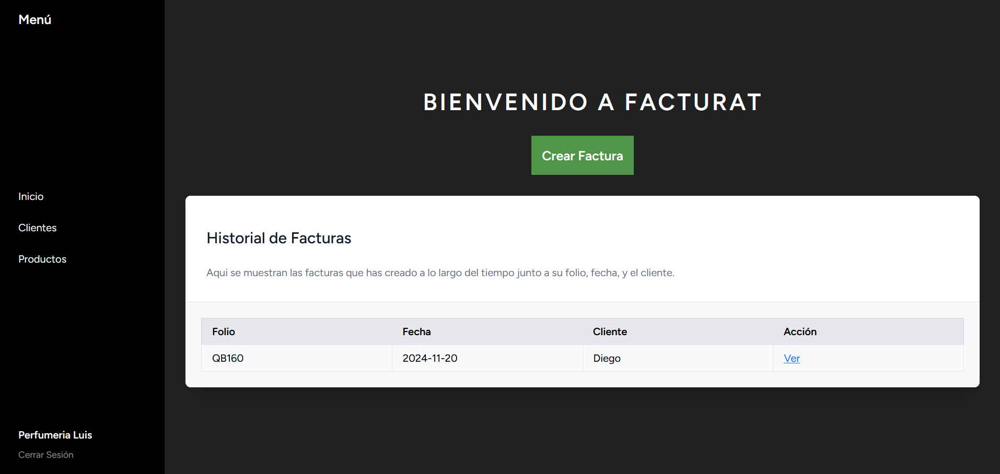
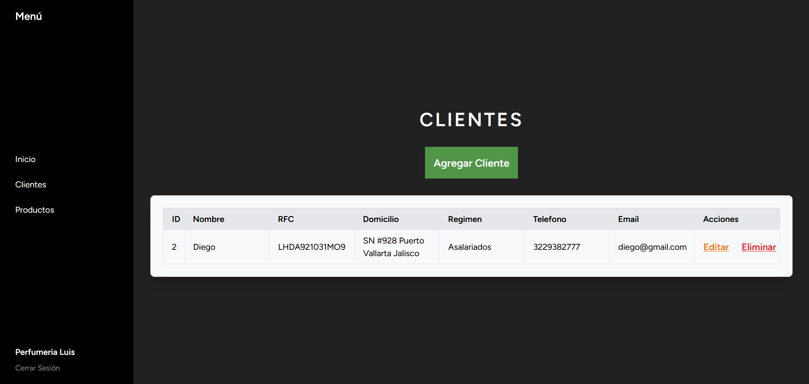
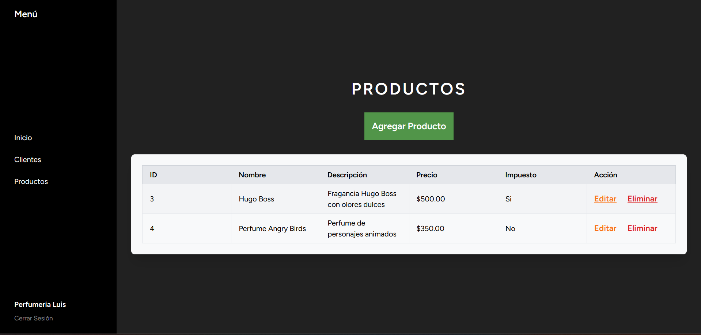
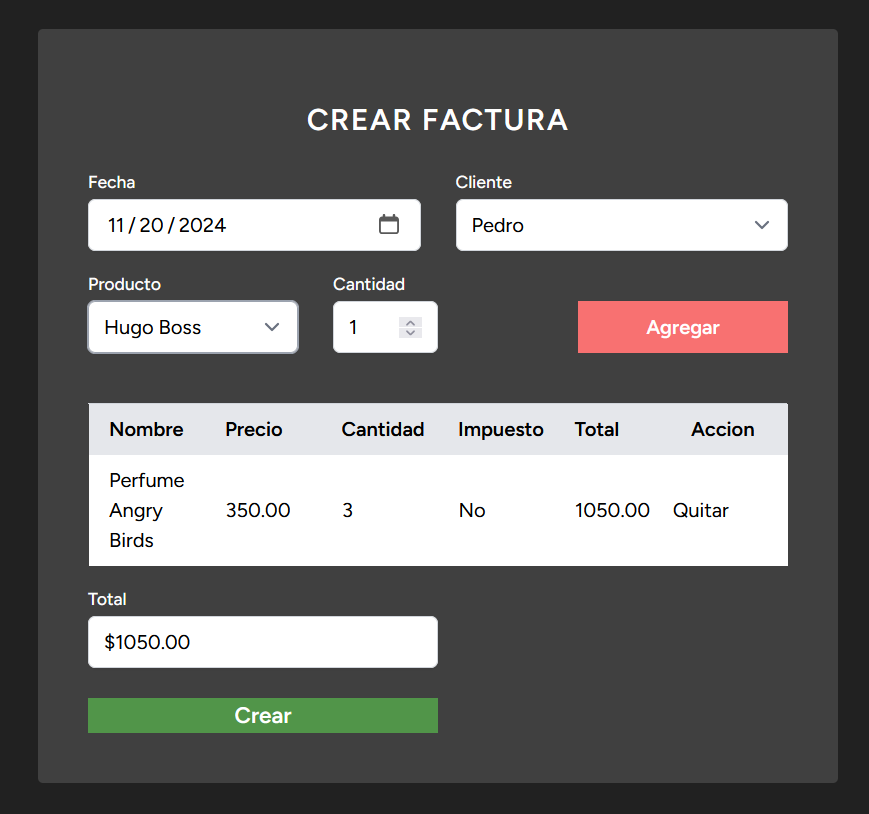
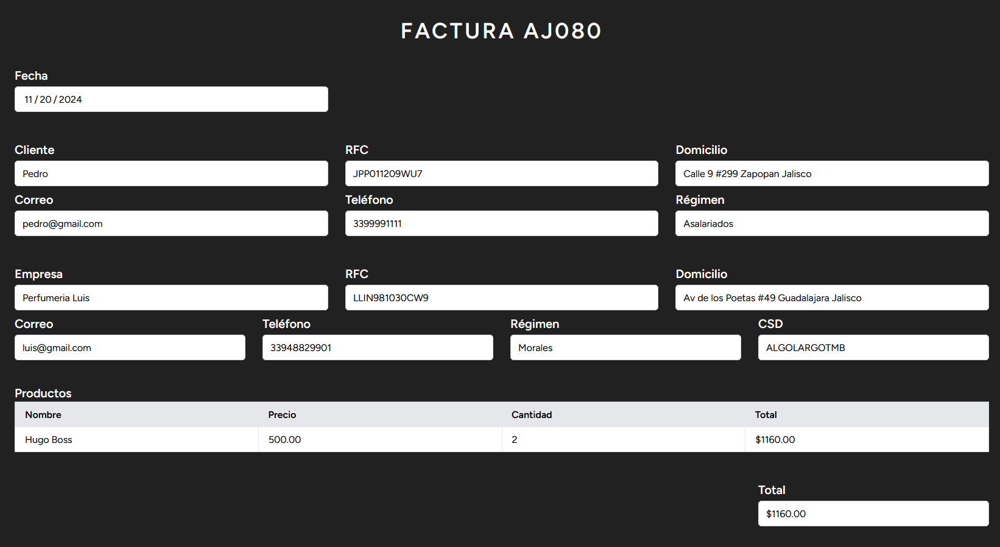

# Sistema de Facturación FacturaT

<h3>Proyecto Final - Programación para Internet</h3>

<h4>Datos</h4>

* Alumno: Ochoa Díaz Raúl Francisco.
* Código: 220790776

<h4>Descripción</h4>

Aplicación web creada con Laravel y Jetstream que permite la creación de facturas.
Además, cuenta con registro para los clientes de la empresa asi como los productos que se facturan.

<h4>Instrucciones de Ejecución</h4>

1. Descargar y configurar Node.js, PHP, Laravel, y Composer en el equipo.

2. Colocarse dentro de la carpeta del proyecto.

3. Instalar las dependencias.

```
composer install
```

4. Duplicar el archivo ```.env.example``` y renombrarlo a ```.env```.

5. Llenar la información de la base de datos para realizar la conexión.

6. Generar la llave de aplicación.

```
php artisan key:generate
```

7. Realizar las migraciones.

```
php artisan migrate
```

8. Correr el programa.

```
php artisan serve
```

<h4>Imágenes</h4>











